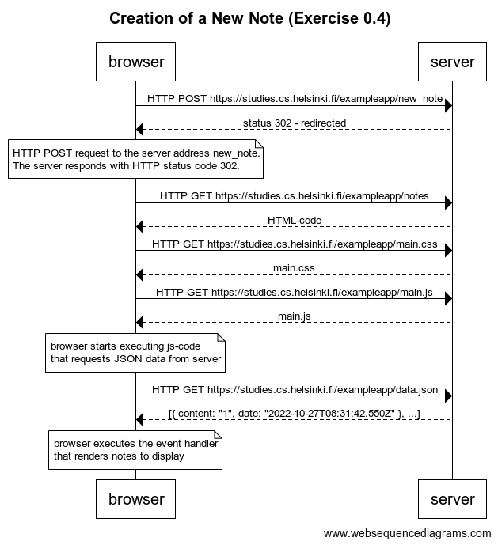

# Exercise 0.4: New note
## Instructions

>In chapter Loading a page containing JavaScript - review the chain of events caused by opening the page https://studies.cs.helsinki.fi/exampleapp/notes is depicted as a sequence diagram

>Create a similar diagram depicting the situation where the user creates a new note on page https://studies.cs.helsinki.fi/exampleapp/notes when writing something into the text field and clicking the submit button.

>If necessary, show operations on the browser or on the server as comments on the diagram.

>The diagram does not have to be a sequence diagram. Any sensible way of presenting the events is fine.

>All necessary information for doing this, and the next two exercises, can be found from the text of this part. The idea of these exercises is to read the text through once more, and to think through what is going on there. Reading the application code is not necessary, but it is of course possible.

# Solution

>It is an HTTP POST request to the server address new_note. The server responds with HTTP status code 302. This is a URL redirect, with which the server asks the browser to do a new HTTP GET request to the address defined in the header's Location - the address notes.

>So, the browser reloads the Notes page. The reload causes three more HTTP requests: fetching the style sheet (main.css), the JavaScript code (main.js), and the raw data of the notes (data.json).