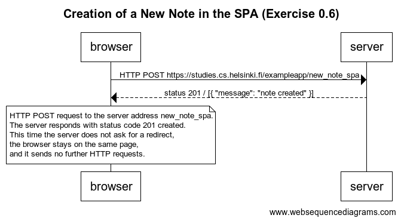

# Exercise 0.6: New note
## Instructions

>Create a diagram depicting the situation where the user creates a new note using the single page version of the app.

# Solution

>The server responds with status code 201 created. This time the server does not ask for a redirect, the browser stays on the same page, and it sends no further HTTP requests.

>The SPA version of the app does not send the form data in the traditional way, but instead uses the JavaScript code it fetched from the server.
